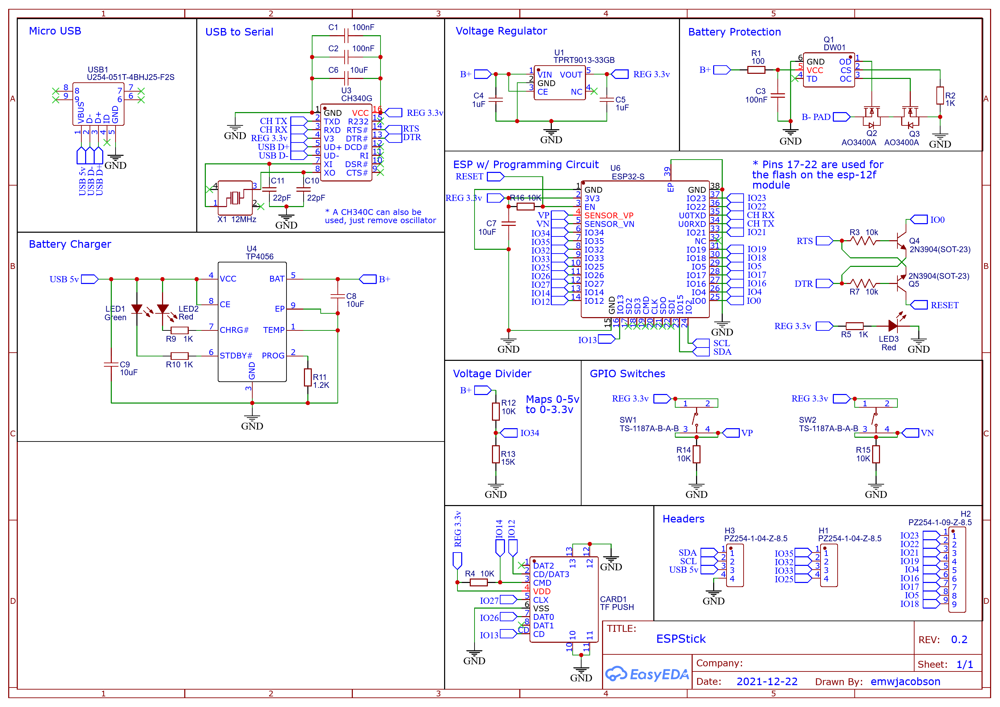
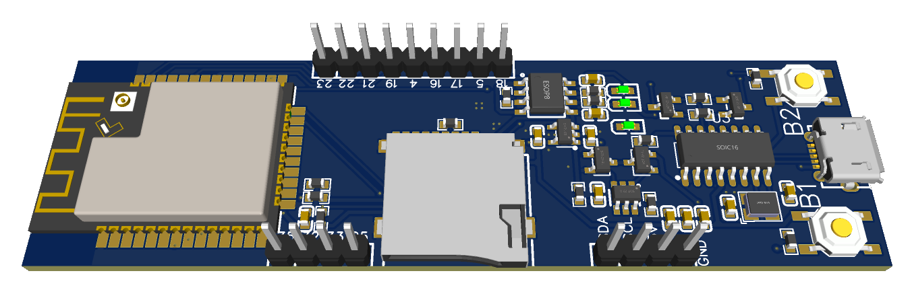

# ESPStick

**NOTE** This project is still a **HEAVY** work in progress! Designs have not yet been tested in person and have the possibility of not working. I have board in the mail, and assembly and testing will begin as soon as I get them :)

## Purpose

The goal of this project, similar to my [ESPHub](https://github.com/emwjacobson/ESPHub) project, is a hardware and software combo project. I've always liked the idea of portable electronics, so for this project I wanted to go for a battery-first design. I wanted to be able to mount an 18650 battery on the bottom while also be able to charge it through a microusb port.

## Usage

I have designed this project alongside my [ESPStick](https://github.com/emwjacobson/ESP32_Wifi_Toolkit) repo, but any code can be ran on it!

One thing to note about this board, is that the two buttons on it are **NOT** the typical Reset and Boot buttons found on other boards. Instead these are wired to the GPIO pins and can be used in software!

## Schematic

## Design Model

